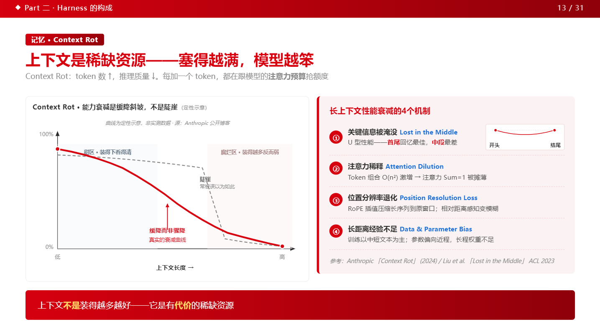
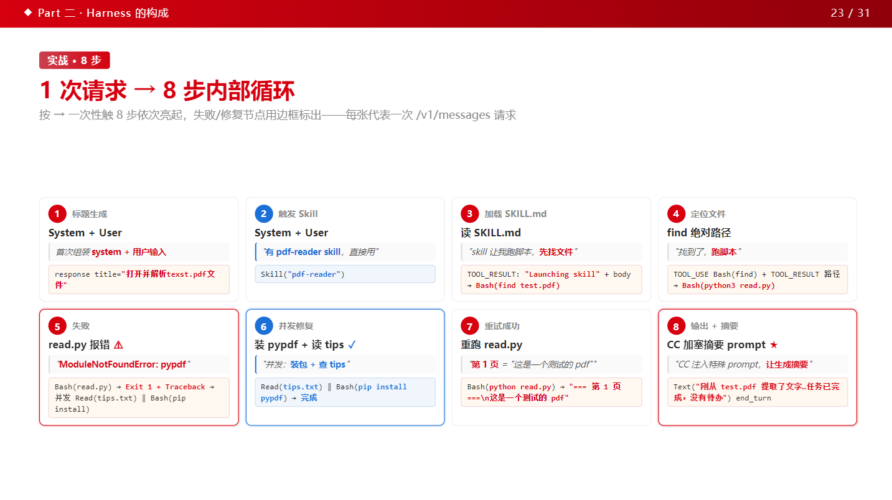
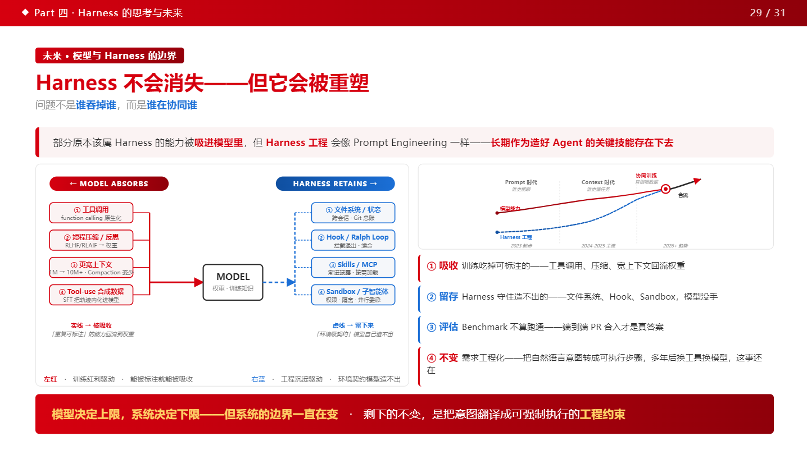

# Harness Engineering · Agent 分享PPT

## 背景

单位让我做一次科普性的技术分享，在制作的过程中我参考了许多公开资料深为受益，我也打算把自己的成果反馈给开源社区，尽绵薄之力。

这是一份纯 HTML/CSS/JS 实现的 16:9 演示文稿，具备一些简单的动画，总共约31页，演讲时长约 20 分钟，内容截止到26年7月。

既然是介绍Agent，我的制作过程全程使用Claude + minimax M3 一起协作完成。


## 适合谁

✅ **适合**
- 第一次接触 Agent / Harness / Context Engineering 这些概念的同事
- 想了解 LLM 工程化基础概念的产品 / 运营 / 技术管理者
- 听过 Claude / GPT 但没动手搭过 Agent 的同学

❌ **不太适合**
- 已经做过 Agent 框架 / 平台开发的资深工程师（内容偏基础）

---

## PPT 内容大纲

| 章节 | 页数 | 主题 |
|---|---|---|
| 封面 + 目录 | 2 | 标题页 + 章节导航 |
| **Part 一 · Harness 的演进** | 2 | Prompt → Context → Harness |
| **Part 二 · Harness 的构成** | 19 | 案例引出 + 六层架构 + MCP / Skill / Memory / Trace 等 |
| **Part 三 · Agent 的评估** | 5 | 评估闭环 + 打分器架构 + pass@k 度量 |
| **Part 四 · Harness 的思考与未来** | 3 | Harness 工程化思考 |

---

## 快速开始

直接双击 `app/core/index.html` 即可在浏览器打开。

**键盘快捷键**

| 按键 | 行为 |
|---|---|
| `←` / `→` / `↑` / `↓` / `PageUp` / `PageDown` / `Space` | 翻页 |
| `Home` / `End` | 跳到首页 / 末页 |
| URL 加 `?p=N` | 直达第 N 页（如 `?p=13`） |

---

## 单文件分享版（适合邮件 / 微信 / U盘）

直接把 8 张图全部内联成 `data:` URI，对方双击 `index.bundled.html` 就能看，不会因为图片外链被屏蔽而失效。

**打包**

```bash
python3 app/core/build-bundled.py
# 产出：app/core/index.bundled.html（含所有图片，约 2.7 MB）
```

**验证打包成功**

```bash
grep -oE 'src="[^"]+"' app/core/index.bundled.html | grep -v '^src="data:' | grep -v '^src="http'
# 应该没有输出（只剩 http 外链）
```

---

## 项目结构

```
agent_ppt/
├── README.md                      ← 本文件
├── CLAUDE.md                      ← 项目说明（寻页规则等）
├── 生成规范.md                    ← 风格规范（颜色 / 字体 / 组件 / 版式）
├── assets/                        ← README 展示图与赞助二维码
└── app/
    └── core/                      ← PPT 主体
        ├── index.html             ← 单页 PPT（含全部 31 页）
        ├── build-bundled.py       ← 单文件打包脚本
        └── *.png / *.jpg          ← 8 张被 PPT 引用的图
```

`assets/` 目录放的是 README 文档配图和赞助二维码（如需新增，直接放进该目录，README 用相对路径引用）。

---

## 二次开发

复用本 PPT 改造成自己的内容：

1. 复制 `app/core/index.html` 作为新模板
2. 每个 `<section class="slide">` 是一页，正文全部用原生 HTML / CSS / SVG
3. 改完后遵循 `生成规范.md`（色板 / 字体 / 组件 / 5 种版式）即可保持风格统一
4. 重新打包分享版：再跑一次 `build-bundled.py`

适合拿来写：
- 团队内部技术分享
- 技术 blog 配套 slides
- 培训材料 / Onboarding 文档

---

## 展示

截取自 PPT 的 3 张代表页面：







---

## 联系与赞助

如果需要合作或交流，可加微信：`caoxulei`

如果这份 PPT 对你有帮助，欢迎扫码赞助：

<p align="center">
  
</p>

---

## License

本项目采用 [MIT License](LICENSE) 开源。

允许在保留版权声明的前提下自由使用、修改、分发（包括商用）。

---

## 参考与致谢

这份 PPT 在准备过程中参考了大量公开 / 半公开资料。由于合规考虑，仓库内仅保留最终成稿；以下资料的内容已被借鉴但**未纳入仓库**。

### 📚 文章与笔记

- 《Agent Harness 的解剖图》— 来自 [Easy AI · code 秘笈花园](https://mmh1.top/)
- 《面向 AI 智能体的高效上下文工程》— 同上

### 🎞️ 演示文稿（PPTX）

- 《ODSC Shah Apr 2026》— Shah

---

> ⚠️ **还参考了大量公开技术社区内容（Anthropic 官方博客、arXiv 论文、技术博客、播客等），未一一列出，可能有遗漏，欢迎提交 PR 或 Issue 指出补充。**
